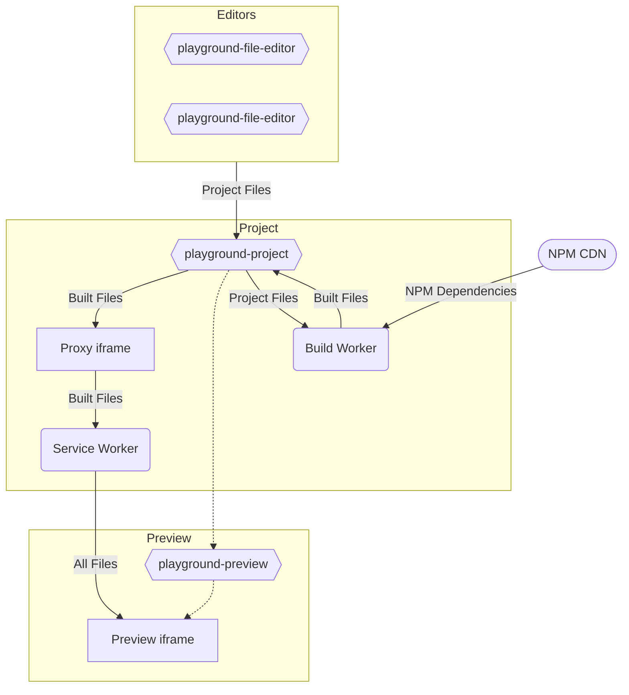

# Architecture

The Playground elements have three features that require a somewhat complex architecture:

- Loading files from the main window into a preview iframe without using a server
- Compiling TypeScript files and resolving bare import specifiers on the fly
- Loading dependencies from a CDN

To accomplish this, the Playground elements have a somewhat complex set of workers and iframes:
- A preview iframe
- A service worker to serve files to the preview iframe
- A web worker to compile TypeScript files and resolve bare import specifiers
- A proxy iframe to install and communicate with the service worker from the main page

These workers and iframes are controlled by various Playground elements like `<playground-project>`, `<playground-preview>`, and `<playground-file-editor>`.

