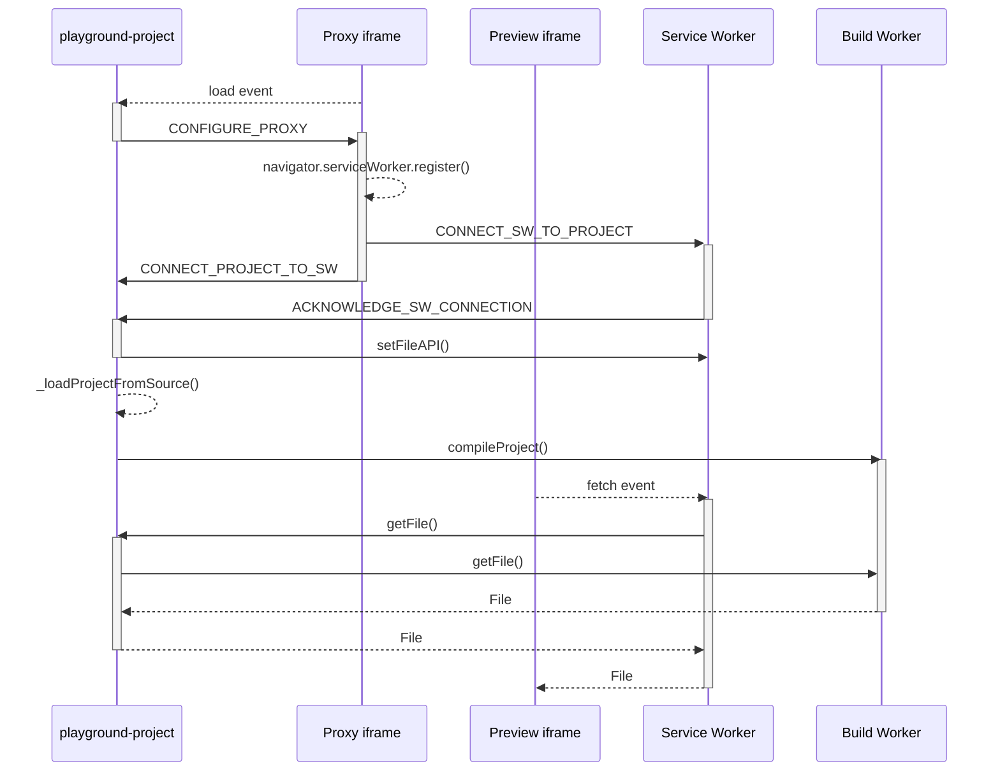

# Architecture

The Playground elements have three features that require a somewhat complex architecture:

- Loading files from the main window into a preview iframe without using a server
- Compiling TypeScript files and resolving bare import specifiers on the fly
- Loading dependencies from a CDN

To accomplish this, the Playground elements have a somewhat complex set of workers and iframes:
- A playground-project element that coordinates most of the initialization and communication
- A preview iframe
- A service worker to serve files to the preview iframe
- A web worker to compile TypeScript files and resolve bare import specifiers
- A proxy iframe to install and communicate with the service worker from the main page

These workers and iframes are controlled by various Playground elements like `<playground-project>`, `<playground-preview>`, and `<playground-file-editor>`.

This chart shows the data flow between components. The arrows show the direction of the primary flow of data, ie, the file being transferred, not the message requesting the file.

This diagram shows the sequence of messages and events between components.

ALL_CAPS labels are direct `postMessage()` messages. methodName() labels on solid lines are Comlink remote method calls over MessagePorts. methodName() labels on loop-back dotted lines are important local invocations. Other dotted lines are responses or browser events.

