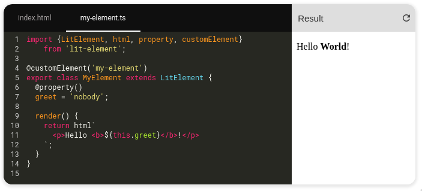
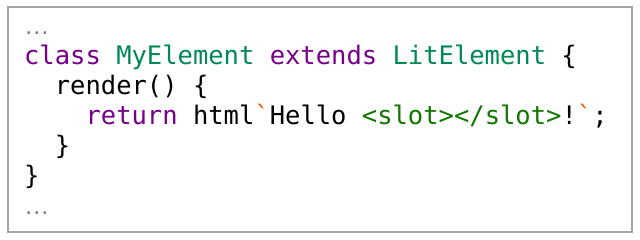
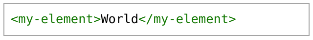
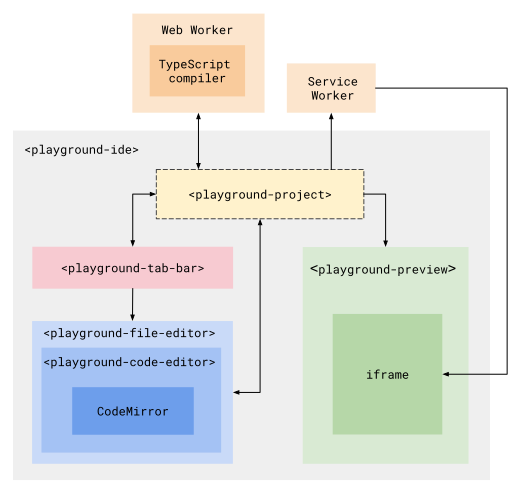

<h1 align="center">playground-elements</h1>

<p align="center">
  <br>
  Serverless coding environments for the web.
  <br>
  <br>
  
 <br><br>
  <a href="https://www.npmjs.com/package/playground-elements">
    </img></a>
  <a href="https://github.com/google/playground-elements/actions/workflows/test.yml">
    </img></a>
  <a href="https://www.npmtrends.com/playground-elements">
    </a>
  <br><br>
    <a href="#overview">Overview</a>
    • <a href="#getting-started">Getting Started</a>
    • <a href="#project-files">Project files</a>
    • <a href="#module-resolution">Module resolution</a>
    • <a href="#typescript">TypeScript</a>
    • <a href="#hiding--folding">Hiding & Folding</a>
    • <a href="#custom-layouts">Custom layouts</a>
    • <a href="#bundling">Bundling</a>
    • <a href="#sandbox-security">Sandbox security</a>
    • <a href="#components">Components</a>
    • <a href="#styling">Styling</a>
    • <a href="#syntax-highlighting">Syntax highlighting</a>
    • <a href="#contributing">Contributing</a>
    • <a href="#faq">FAQ</a>
</p>

## Overview

Playground Elements are a set of components for creating interactive editable
coding environments on the web, with live updating previews. You can use
Playground Elements to:

- Embed editable code examples in your documentation.
- Build interactive tutorials and example galleries.
- Build full-featured coding sandboxes (think Glitch or JSBin).

#### 🤯 No backend required

Unlike other coding environments, Playground never sends code to a backend
server. Instead, Playground uses a [Service
Worker](https://developer.mozilla.org/en-US/docs/Web/API/Service_Worker_API) to
create a virtual URL-space that runs 100% within the browser. If you can host
static files, you can host a Playground.

####  TypeScript support

Playground automatically compiles `.ts` files using TypeScript, and
automatically fetches typings for your imports in order to display errors.
Compilation happens in a Web Worker on a separate thread, so your page stays
responsive.

#### 🧩 Web Components

Playground uses Web Components, so it doesn't require a framework. But it will
play nicely with any framework you're already using, like React, Vue, and
Angular.

#### 🍱 Mix-and-match for flexible layout

Playground is broken up into small components like an editor, file picker, and
preview. Mix-and-match components to create any layout you want, or just use
`<playground-ide>` for an easy out-of-the-box experience.

#### 🎨 Themable

Playground is fully themeable with CSS Custom Properties, down to the color of
each kind of syntax-highlighted token. You can import themes from VSCode using
the [configurator](https://google.github.io/playground-elements/), and it
comes with a number of presets too.

---

<h3 align="center">
  <a href="https://google.github.io/playground-elements/">
    Try the demo and configurator!
  </a>
</h3>

---

## Getting Started

### Install

Install from NPM:

```sh
npm i playground-elements
```

```html
<script
  type="module"
  src="/node_modules/playground-elements/playground-ide.js"
></script>
```

### Hello World

Create a `<playground-ide>` element in your HTML, and specify your project files
inline:

```html
<playground-ide editable-file-system line-numbers resizable>
  <script type="sample/html" filename="index.html">
    <!doctype html>
    <body>
      Hello
      <script type="module" src="./index.js">&lt;/script>
    </body>
  </script>

  <script type="sample/ts" filename="index.ts">
    document.body.appendChild(document.createTextNode("World!"))
  </script>
</playground-ide>
```

### Serve

Use a server like
[@web/dev-server](https://modern-web.dev/docs/dev-server/overview/) to handle
bare module import resolution automatically:

```sh
npm i -D @web/dev-server
npx web-dev-server --node-resolve --watch
```

Or, use a tool like [Rollup](https://rollupjs.org/guide/en/) to resolve bare
module imports to paths at build time. If you need more help with building and
serving, check out the [Modern Web Guides](https://modern-web.dev/guides/).

### Compatibility

Playground is supported by all modern browsers. It requires support for custom
elements, JS modules, service workers, and web workers.

&nbsp;&nbsp;&nbsp; **Supported:** &nbsp;&nbsp;  Chrome
&nbsp;&nbsp;&nbsp;
  Firefox
&nbsp;&nbsp;&nbsp;
  Safari
&nbsp;&nbsp;&nbsp;
  Edge

**Unsupported:** &nbsp;   Internet Explorer

## Project files

There are 3 ways to specify the files of a playground project:

### Option 1: Inline scripts

Add one or more `<script>` tags as children of
your `<playground-ide>` or `<playground-project>`, using the following attributes:

| Attribute             | Description                                                                                                           |
| --------------------- | --------------------------------------------------------------------------------------------------------------------- |
| `type`                | Required filetype. Options: `sample/html`, `sample/css`, `sample/js`, `sample/ts`, `sample/json`, `sample/importmap`. |
| `filename`            | Required filename.                                                                                                    |
| `label`               | Optional label for display in `playground-tab-bar`. If omitted, the filename is displayed.                            |
| `hidden`              | If present, the file won't be visible in `playground-tab-bar`.                                                        |
| `selected`            | If present, this file's tab will be selected when the project is loaded. Only one file should have this attribute.    |
| `preserve-whitespace` | Disable the default behavior where leading whitespace that is common to all lines is removed.                         |

Be sure to escape closing `</script>` tags within your source as `&lt;/script>`.

```html
<playground-project>
  <script type="sample/html" filename="index.html">
    <!doctype html>
    <head>
      <script type="module" src="javascript.js">&lt;/script>
      <script type="module" src="typescript.js">&lt;/script>
      <link rel="stylesheet" href="styles.css">
    </head>
    <body>
      <p>Hello World!</p>
    </body>
  </script>

  <script type="sample/js" filename="javascript.js">
    console.log('hello from javascript');
  </script>

  <script type="sample/ts" filename="typescript.ts">
    console.log('hello from typescript');
  </script>

  <script type="sample/css" filename="styles.css">
    body { color: blue; }
  </script>
</playground-project>
```

### Option 2: JSON configuration

Set the `project-src` attribute or `projectSrc` property to a JSON file with format:

| Property            | Description                                                                                                                                                                      |
| ------------------- | -------------------------------------------------------------------------------------------------------------------------------------------------------------------------------- |
| `files`             | An object mapping filenames to file data.                                                                                                                                        |
| `files.content`     | Optional text content of the file. If omitted, a `fetch` is made to retrieve the file by filename, relative to the manifest URL.                                                 |
| `files.contentType` | Optional MIME type of the file. If omitted, type is taken from either the `fetch` response `Content-Type` header, or inferred from the filename extension when `content` is set. |
| `files.label`       | Optional label for display in `playground-tab-bar`. If omitted, the filename is displayed.                                                                                       |
| `files.hidden`      | If `true`, the file won't be visible in `playground-tab-bar`.                                                                                                                    |
| `files.selected`    | If `true`, this file's tab will be selected when the project is loaded. Only one file should have this field set.                                                                |
| `extends`           | Optional URL to another JSON config file to extend from. Configs are deeply merged. URLs are interpreted relative to the URL of each extendee config.                            |

```html
<playground-ide project-src="/path/to/my/project.json"> </playground-ide>
```

```json
{
  "files": {
    "index.html": {},
    "typescript.ts": {
      "content": "console.log('hello');"
    },
    "javascript.js": {
      "contentType": "text/javascript"
    },
    "styles.css": {
      "label": "Style"
    }
  }
}
```

### Option 3: Config property

In JavaScript, directly set the `config` property to an object. The format is
identical to the JSON config file.

```js
const ide = document.querySelector('playground-ide');
ide.config = {
  files: {
    'index.html': {},
    'typescript.ts': {
      content: "console.log('hello');",
    },
  },
};
```

If both `project-src` and `config` are set, then the one set most recently has
precedence. When either are set, inline scripts are ignored.

## Module resolution

By default, bare module specifiers in JavaScript and TypeScript files are
transformed to special `./node_modules/` URLs, and fetched behind-the-scenes
from unpkg.com at the latest version.

```js
// What you write:
import {html} from 'lit';

// What playground serves:
import {html} from './node_modules/lit@2.0.2/index.js';

// What playground fetches behind-the-scenes:
// https://unpkg.com/lit@latest
```

### `package.json`

To customize the version of a module you import, create a file called
`package.json` in your project containing a
[`dependencies`](https://docs.npmjs.com/cli/v7/configuring-npm/package-json#dependencies)
map. This works exactly like it does when using NPM locally.

```json
{
  "dependencies": {
    "lit": "^2.0.2"
  }
}
```

> TIP: Use the `hidden` [attribute](#option-1-inline-scripts) or
> [property](#option-2-json-configuration) to hide the `package.json` file from
> being displayed in the list of project files, if you don't want the end-user
> to be able to see or modify it.

### Export conditions

Playground supports Node-style [export
conditions](https://nodejs.org/api/packages.html#packages_exports) when
resolving modules in dependencies, and sets the following
[conditions](https://nodejs.org/api/packages.html#packages_conditional_exports):
`module`, `import`, `development`, and `browser`.

### Import maps

For full control over module resolution, you can configure an _import map_. You
may want to do this to change CDNs or point to a locally served copy of a
module:

```js
{
  "files": { ... },
  "importMap": {
    "imports": {
      "lit": "https://cdn.skypack.dev/lit@^2.0.2",
      "lit/": "https://cdn.skypack.dev/lit@^2.0.2/"
    }
  }
}
```

When using inline project files, you can specify your import map like so:

```html
<playground-ide>
  <script type="sample/importmap">
    {
      "imports": {
        "lit": "https://cdn.skypack.dev/lit@^2.0.2",
        "lit/": "https://cdn.skypack.dev/lit@^2.0.2/"
      }
    }
  </script>
  ...
</playground-ide>
```

If an import map is defined, but does not contain an entry for a bare module,
then playground defaults to the `unpkg.com` URL.

## TypeScript

Playground automatically compiles `.ts`, `.tsx`, and `.jsx` files using
[TypeScript](https://www.typescriptlang.org/).

The following compiler settings are used:

| Name                                                                                       | Value      |
| ------------------------------------------------------------------------------------------ | ---------- |
| [`target`](https://www.typescriptlang.org/tsconfig#target)                                 | `es2021`   |
| [`module`](https://www.typescriptlang.org/tsconfig#module)                                 | `esnext`   |
| [`moduleResolution`](https://www.typescriptlang.org/tsconfig#moduleResolution)             | `nodenext` |
| [`experimentalDecorators`](https://www.typescriptlang.org/tsconfig#experimentalDecorators) | `true`     |
| [`allowJs`](https://www.typescriptlang.org/tsconfig#allowJs)                               | `true`     |
| [`jsx`](https://www.typescriptlang.org/tsconfig#jsx)                                       | `react`    |

Note that when you import from another project module, the import
statement should use the `.js` extension (the same as you would do when running
`tsc` locally):

```ts
import './my-other-module.js';
```

You may also include any Definitely Typed (`@types`) packages for type checking
during compilation by listing it as a dependency in the project's
[`package.json` file](#packagejson).

## Hiding & folding

If a region of code in a Playground project file is surrounded by
`playground-hide` and `playground-hide-end` comments, then that region won't be
visible or editable by the user, but it will still be compiled and served.

Similarly, if a region is surrounded by `playground-fold` and
`playground-fold-end` comments, then the region will be replaced with a `…` that
expands to reveal the original editable code when clicked.

Use these special regions to help users focus on a particular part of a file, by
de-emphasizing boilerplate or unrelated code.

#### JavaScript fold example

Note that JavaScript `//` style comments are not supported.

```ts
/* playground-fold */
import {html, LitElement} from 'lit';
/* playground-fold-end */

class MyElement extends LitElement {
  render() {
    return html`Hello <slot></slot>!`;
  }
}
/* playground-fold */

customElements.define('my-element', MyElement);
```

Result:



#### HTML hide example

<!-- prettier-ignore -->
```html
<!-- playground-hide -->
<head>
  <title>Boring stuff</title>
  <script type="module" src="./my-element.js"></script>
</head>
<body>
<!-- playground-hide-end -->
<my-element>World</my-element>
<!-- playground-hide -->
</body>
<!-- playground-hide-end -->
```

Result:



#### Disabling

Hiding and folding is enabled by default, but can be disabled by setting the
`pragmas` property to `"off"` (disabled with comments hidden) or `"off-visible"`
(disabled with comments visible). The `pragmas` property is available on `ide`,
`file-editor`, and `code-editor`.

## Custom layouts

`<playground-ide>` provides a complete out-of-the-box experience that's a good
start for many use-cases, but you can mix-and-match the various Playground
sub-components to make your custom layouts.

For example, say we need a layout with an editor above, a preview below, and
only one particular file from the project visible — like this:


To do this, first import just the components you need. The main
`playground-elements` import loads all Playground elements, but when making a
custom layout it's a good idea to only load the sub-components you're actually
using. This will make your JavaScript bundle smaller.

```html
<script type="module">
  import 'playground-elements/playground-project.js';
  import 'playground-elements/playground-file-editor.js';
  import 'playground-elements/playground-preview.js';
</script>
```

Next create a `<playground-project>`, with some inline project files. We could also
write our project files separately, and specify them in a JSON manifest. This
project element manages the virtual file system, and coordinates with the
Playground workers. We give it a unique `id`, which we'll use to connect up the
editor and preview.

```html
<playground-project id="project1">
  <script type="sample/ts" filename="index.ts">
    window.addEventListener('DOMContentLoaded', () => {
      const world = document.createTextNode(' World!');
      document.body.appendChild(world);
    });
  </script>

  <script type="sample/html" filename="index.html">
    <!doctype html>
    <head>
      <script type="module" src="./index.js">&lt;/script>
    </head>
    <body>Hello</body>
  </script>
</playground-project>
```

Next create an editor and preview. Connect both to the project by setting the
`property` attribute to the project element's `id`. We could also directly set
the `project` _property_ to the project element, if we were using JavaScript.

By setting the `filename` attribute on the editor, we've pinned it to one
particular file. Since we didn't include a `<playground-tab-bar>`, there's no
way for the user to see or switch to other files in the project.

```html
<div class="example">
  <playground-file-editor
    project="project1"
    filename="index.ts"
  ></playground-file-editor>

  <playground-preview project="project1"> </playground-preview>
</div>
```

Finally, add a little style:

```html
<style>
  .example {
    width: 500px;
    border: 1px solid #ccc;
  }
  .example > playground-file-editor {
    height: 110px;
  }
  .example > playground-preview {
    height: 100px;
    border-top: 1px solid #ccc;
    --playground-preview-toolbar-background: #eaeaea;
  }
</style>
```

## Bundling

Playground uses a [Web
Worker](https://developer.mozilla.org/en-US/docs/Web/API/Web_Workers_API/Using_web_workers)
to perform TypeScript compilation. If you are bundling or otherwise modifying
the layout of the `playground-elements` NPM package, you may need to add special
handling for this file.

### Rollup

Use the Rollup
[`@web/rollup-plugin-import-meta-assets`](https://github.com/modernweb-dev/web/tree/master/packages/rollup-plugin-import-meta-assets#readme)
plugin to automatically copy the worker script into the correct location. See
[examples/rollup](https://github.com/google/playground-elements/tree/main/examples/rollup)
for an example configuration.

### Webpack

Webpack 5+ [automatically supports loading Web
Workers](https://webpack.js.org/guides/web-workers/) with no additional plugins.
See
[examples/webpack](https://github.com/google/playground-elements/tree/main/examples/webpack)
for an example configuration.

### Other

If you are bundling in another way, you'll need to configure your build so that
the file `node_modules/playground-elements/playground-typescript-worker.js` is
copied into the same directory as your bundle.

For example, if you bundled playground elements into `./js/app.js`, then you
should copy the worker module to `./js/playground-typescript-worker.js`.

## Sandbox security

> ⚠️ Changing the sandbox base URL from the default can create a security
> vulnerability for your site if not done carefully. Do not change the default
> unless you have a specific reason to, and please read this entire section
> carefully.

The `sandboxBaseUrl` property and `sandbox-base-url` attribute can be used to
override the origin where untrusted code will execute when displaying Playground
previews. The default origin is unpkg.com, which is secure because it is
unprivileged and cannot modify the host window.

You may wish to override this default sandbox base URL if you do not want a
dependency on `unpkg.com`, e.g. for isolation from outages, or because your
network does not have access to it. Note that Playground currently also uses
`unpkg.com` to retrieve imported bare modules that are not otherwise handled by
an [import map](#module-resolution), so the `unpkg.com` dependency cannot
currently be completely eliminated.

### Background

Playground previews work by using a [service
worker](https://developer.mozilla.org/en-US/docs/Web/API/Service_Worker_API).
This service worker takes control over requests to a particular URL space,
allowing it to respond to HTTP requests using the files from your local project,
instead of from a remote server. The playground preview component contains an
`<iframe>` pointing to the `index.html` within that URL space.

When JavaScript in this preview `<iframe>` executes, it does so with the full
privileges of whichever
[origin](https://developer.mozilla.org/en-US/docs/Glossary/Origin) the service
worker was registered on. This means it can access cookies on that origin, make
HTTP requests to sensitive URLs on that origin, and directly access the
`<iframe>` parent window if it has the same origin.

The JavaScript in Playground project files should always be considered untrusted
and potentially malicious. This is particularly the case if you implement a
_share_ feature, because a user can be tricked into executing malicious code
simply by visiting a URL.

By default, the sandbox base URL is
`https://unpkg.com/playground-elements@<version>/playground-projects/`. This is
a secure default because `unpkg.com` is unprivileged and cannot modify the host
window.

### Requirements

If you change the sandbox base URL from the default, ensure that the new URL
meets all of the following requirements:

1. Must be a different
   [origin](https://developer.mozilla.org/en-US/docs/Glossary/Origin) to the
   origin hosting the Playground components. This prevents untrusted code from
   modifying the parent window using `window.parent`, e.g. to change your
   sign-in link to a malicious URL.

   > NOTE: It is highly recommended to furthermore use either an entirely
   > different _site_, or to use the `Origin-Agent-Cluster` header, to improve
   > performance and prevent lockups. See [Process
   > isolation](#process-isolation) for more information.

2. Must not have access to any sensitive cookies. This prevents untrusted code
   from e.g. reading and forwarding your user's authentication token.

3. Must not have access to any sensitive resources or APIs, either through the
   [same-origin
   policy](https://developer.mozilla.org/en-US/docs/Web/Security/Same-origin_policy),
   or through [CORS](https://developer.mozilla.org/en-US/docs/Web/HTTP/CORS)
   headers that grant the origin access to resources on other origins. This
   prevents untrusted code from e.g. making a request to your `get_credit_card`
   or `change_password` APIs.

4. Must serve the following two pre-minified files from the
   `playground-elements` NPM package _at the same version as your imported
   components_:
   - `playground-service-worker.js`
   - `playground-service-worker-proxy.html`

#### Process isolation

Some browsers such as Chrome are sometimes able to allocate a separate process
or thread for iframes. This is highly desirable for Playground, because it
improves responsiveness and prevents full lockups (resulting from e.g. an
infinite loop accidentally written by a user).

By default, this iframe process isolation can only occur if the iframe and the
parent window are _different sites_. While an _origin_ is defined by (protocol +
subdomain + top-level domain + port), a _site_ is defined only by (protocol +
top-level domain). For example, `example.com` and `foo.example.com` are
different-origin but same-site, whereas `example.com` and `example.net` are
different-origin and different-site.

Alternatively, if the `Origin-Agent-Cluster: ?1` header is set on all server
responses from one or the other origins, then iframe process isolation can also
occur with different-origin but same-site configurations. Note that this header
must truly be set on _all_ responses from the origin, because the browser will
remember the setting based on the _first response_ it gets from that origin. See
_["Requesting performance isolation with the Origin-Agent-Cluster
header"](https://web.dev/origin-agent-cluster/)_ for more information about this
header.

## Components

<!--
The following diagram shows how the Playground components coordinate in a
typical IDE layout:



-->

[`<playground-ide>`](#playground-ide)
• [`<playground-project>`](#playground-project)
• [`<playground-file-editor>`](#playground-file-editor)
• [`<playground-code-editor>`](#playground-code-editor)
• [`<playground-preview>`](#playground-preview)
• [`<playground-tab-bar>`](#playground-tab-bar)
• [`<playground-file-system-controls>`](#playground-file-system-controls)

---

## `<playground-ide>`

All-in-one project, editor, file switcher, and preview with a horizontal side-by-side layout.

### Properties

| Name                 | Type                             | Default                   | Description                                                                                                                                                                                        |
| -------------------- | -------------------------------- | ------------------------- | -------------------------------------------------------------------------------------------------------------------------------------------------------------------------------------------------- |
| `projectSrc`         | `string`                         | `undefined`               | URL of the [project manifest](#project-manifest) to load                                                                                                                                           |
| `config`             | `ProjectManifest`                | `undefined`               | Get or set the project configuration and files, ([details](#option-3-config-property)).                                                                                                            |
| `lineNumbers`        | `boolean`                        | `false`                   | Render a gutter with line numbers in the editor                                                                                                                                                    |
| `lineWrapping`       | `boolean`                        | `false`                   | If `true`, long lines are wrapped, otherwise the editor will scroll.                                                                                                                               |
| `editableFileSystem` | `boolean`                        | `false`                   | Allow adding, removing, and renaming files                                                                                                                                                         |
| `resizable`          | `boolean`                        | `false`                   | Allow dragging the line between editor and preview to change relative sizes                                                                                                                        |
| `sandboxBaseUrl`     | `string`                         | _module parent directory_ | Base URL for untrusted JavaScript execution (⚠️ use with caution, see [sandbox security](#sandbox-security)). Resolved relative to the module containing the definition of `<playground-project>`. |
| `pragmas`            | `"on" \| "off" \| "off-visible"` | `"on"`                    | How to handle `playground-hide` and `playground-fold` comments ([details](#hiding--folding)).                                                                                                      |
| `modified`           | `boolean`                        | `false`                   | Whether the user has modified, added, or removed any project files. Resets whenever a new project is loaded.                                                                                       |
| `htmlFile`           | `string`                         | `"index.html"`            | The HTML file used in the preview.                                                                                                                                                                 |
| `noCompletions`      | `boolean`                        | `false`                   | If interactive code completions should be shown. This setting only applies to TypeScript files.                                                                                                    |

### Slots

| Name      | Description                               |
| --------- | ----------------------------------------- |
| `default` | Inline files ([details](#inline-scripts)) |

---

## `<playground-project>`

Invisible element that coordinates the filesystem, build worker, and service
worker. Unless you're using `<playground-ide>`, all Playground layouts need a
project element.

### Properties

| Name             | Type                          | Default                   | Description                                                                                                                                                                                        |
| ---------------- | ----------------------------- | ------------------------- | -------------------------------------------------------------------------------------------------------------------------------------------------------------------------------------------------- |
| `projectSrc`     | `string`                      | `undefined`               | URL of a [project files manifest](#option-2-json-manifest) to load.                                                                                                                                |
| `config`         | `ProjectManifest`             | `undefined`               | Get or set the project configuration and files, ([details](#option-3-config-property)).                                                                                                            |
| `sandboxScope`   | `string`                      | `"playground-elements"`   | The service worker scope to register on.                                                                                                                                                           |
| `sandboxBaseUrl` | `string`                      | _module parent directory_ | Base URL for untrusted JavaScript execution (⚠️ use with caution, see [sandbox security](#sandbox-security)). Resolved relative to the module containing the definition of `<playground-project>`. |
| `diagnostics`    | `Map<string, lsp.Diagnostic>` | `undefined`               | Map from filename to array of Language Server Protocol diagnostics resulting from the latest compilation.                                                                                          |
| `modified`       | `boolean`                     | `false`                   | Whether the user has modified, added, or removed any project files. Resets whenever a new project is loaded.                                                                                       |

### Methods

| Method                                         | Description                                                  |
| ---------------------------------------------- | ------------------------------------------------------------ |
| `addFile(filename: string)`                    | Create a new file. Type is inferred from filename extension. |
| `deleteFile(filename: string)`                 | Delete a file.                                               |
| `renameFile(oldName: string, newName: string)` | Rename a file.                                               |

### Slots

| Name      | Description                               |
| --------- | ----------------------------------------- |
| `default` | Inline files ([details](#inline-scripts)) |

### Events

| Event          | Description                            |
| -------------- | -------------------------------------- |
| `filesChanged` | A file was added, removed, or renamed. |
| `urlChanged`   | The preview URL has changed            |
| `compileStart` | A build has started.                   |
| `compileEnd`   | A build has completed.                 |

---

## `<playground-tab-bar>`

### Properties

| Property             | Type                             | Default     | Description                                                                                                       |
| -------------------- | -------------------------------- | ----------- | ----------------------------------------------------------------------------------------------------------------- |
| `project`            | `string \| PlaygroundProject`    | `undefined` | The project this bar is associated with. Either the `<playground-project>` itself, or its `id` in the host scope. |
| `editor`             | `string \| PlaygroundFileEditor` | `undefined` | The editor this bar controls. Either the `<playground-file-editor>` itself, or its `id` in the host scope.        |
| `editableFileSystem` | `boolean`                        | `false`     | Allow adding, removing, and renaming files                                                                        |

---

## `<playground-file-editor>`

### Properties

| Name            | Type                              | Default     | Description                                                                                                                    |
| --------------- | --------------------------------- | ----------- | ------------------------------------------------------------------------------------------------------------------------------ |
| `project`       | `string \| PlaygroundProject`     | `undefined` | The project that this editor is associated with. Either the `<playground-project>` node itself, or its `id` in the host scope. |
| `filename`      | `string`                          | `undefined` | The name of the project file that is currently being displayed. Set when changing tabs. Does not reflect to attribute.         |
| `type`          | `"js" \| "ts" \| "html" \| "css"` | `undefined` | File type.                                                                                                                     |
| `lineNumbers`   | `boolean`                         | `false`     | Render a gutter with line numbers in the editor                                                                                |
| `pragmas`       | `"on" \| "off" \| "off-visible"`  | `"on"`      | How to handle `playground-hide` and `playground-fold` comments ([details](#hiding--folding)).                                  |
| `readonly`      | `boolean`                         | `false`     | Do not allow edits                                                                                                             |
| `noCompletions` | `boolean`                         | `false`     | If interactive code completions should be shown. This setting only applies to TypeScript files.                                |

---

## `<playground-code-editor>`

A pure text editor based on CodeMirror with syntax highlighting for HTML, CSS, JavaScript, and TypeScript.

### Properties

| Name            | Type                              | Default     | Description                                                                                        |
| --------------- | --------------------------------- | ----------- | -------------------------------------------------------------------------------------------------- |
| `value`         | `string`                          | `""`        | Code as string                                                                                     |
| `type`          | `"js" \| "ts" \| "html" \| "css"` | `undefined` | Language of the file to syntax highlight                                                           |
| `readonly`      | `boolean`                         | `false`     | Do not allow edits                                                                                 |
| `lineNumbers`   | `boolean`                         | `false`     | Render a gutter with line numbers in the editor                                                    |
| `pragmas`       | `"on" \| "off" \| "off-visible"`  | `"on"`      | How to handle `playground-hide` and `playground-fold` comments ([details](#hiding--folding)).      |
| `documentKey`   | `object`                          | `undefined` | Editor history for undo/redo is isolated per `documentKey`. Default behavior is a single instance. |
| `noCompletions` | `boolean`                         | `false`     | If interactive code completions should be shown. This setting only applies to TypeScript files.    |

### Events

| Event    | Description                          |
| -------- | ------------------------------------ |
| `change` | User made an edit to the active file |

### Keyboard shortcuts

The playground code editor extends the
[CodeMirror default keyboard shortcuts](https://github.com/codemirror/CodeMirror/blob/master/src/input/keymap.js)
with the following:

| Keyboard shortcut       | Description                            |
| ----------------------- | -------------------------------------- |
| `Ctrl + Space`          | Trigger code completion when supported |
| `Ctrl + /` or `Cmd + /` | Toggle line comments                   |
| `ESC`                   | De-focus the code editor               |

---

## `<playground-preview>`

### Properties

| Name       | Type                        | Default        | Description                                                                                                                    |
| ---------- | --------------------------- | -------------- | ------------------------------------------------------------------------------------------------------------------------------ |
| `project`  | `string PlaygroundProject`  | `undefined`    | The project that this editor is associated with. Either the `<playground-project>` node itself, or its `id` in the host scope. |
| `location` | `string`                    | `""`           |                                                                                                                                |
| `htmlFile` | `string`                    | `"index.html"` | The HTML file used in the preview.                                                                                             |
| `iframe`   | `HTMLIFrameElement \| null` | `null`         | A reference to the internal iframe element that is used to render the preview.                                                 |

---

## `<playground-file-system-controls>`

Floating controls for adding, deleting, and renaming files.

### Properties

| Name            | Type                                          | Default     | Description                                                                                                                                                                                                   |
| --------------- | --------------------------------------------- | ----------- | ------------------------------------------------------------------------------------------------------------------------------------------------------------------------------------------------------------- |
| `state`         | `"closed" \| "menu" \| "rename" \| "newfile"` | `"closed"`  | The kind of control to display.<br><br>`closed`: Hidden.<br>`menu`: Menu with "Rename" and "Delete" items.<br>`rename`: Control for renaming an existing file.<br>`newfile`: Control for creating a new file. |
| `filename`      | `string`                                      | `undefined` | When state is `menu` or `newfile`, the name of the relevant file.                                                                                                                                             |
| `anchorElement` | `HTMLElement`                                 | `undefined` | Absolutely position these controls at the bottom-left corner of this element.                                                                                                                                 |

### Events

| Event     | Detail               | Description                                                |
| --------- | -------------------- | ---------------------------------------------------------- |
| `newFile` | `{filename: string}` | The specified new file was created through these controls. |

## Styling

**TIP:** Use the [configurator](https://google.github.io/playground-elements/)
to quickly experiment with themes and other customizations.

### Custom Properties

| Name                                             | Default                                                                       | Description                                                                                                                        |
| ------------------------------------------------ | ----------------------------------------------------------------------------- | ---------------------------------------------------------------------------------------------------------------------------------- |
| `--playground-bar-height`                        | `40px`                                                                        | `height` of the tab bar and the preview bar                                                                                        |
| `--playground-code-font-family`                  | `monospace`                                                                   | `font-family` of code in the editor                                                                                                |
| `--playground-code-font-size`                    | `14px`                                                                        | `font-size` of code in the editor                                                                                                  |
| `--playground-code-line-height`                  | `1.4em`                                                                       | `line-height` of code in the editor                                                                                                |
| `--playground-code-TOKEN-color`                  | _various_                                                                     | Color of each kind of `TOKEN` in syntax highlighted-code. See the [syntax highlighting](#syntax-highlighting) section for details. |
| `--playground-highlight-color`                   |  `#6200EE`                                       | Color of the active file-picker tab label and indicator, and the preview loading bar                                               |
| `--playground-code-background`                   |  `#FFFFFF`                                       | `background` of the code editor                                                                                                    |
| `--playground-code-gutter-background`            |  `var(--playground-code-background, #FFFFFF)`    | `background` of the line-numbers gutter                                                                                            |
| `--playground-code-gutter-box-shadow`            | `none`                                                                        | `box-shadow` of the line-numbers gutter                                                                                            |
| `--playground-code-gutter-border-right`          | `none`                                                                        | `border-right` of the line-numbers gutter                                                                                          |
| `--playground-code-linenumber-color`             |  `#767676`                                       | `color` of line-numbers                                                                                                            |
| `--playground-code-cursor-color`                 |  `var(--playground-code-default-color, #000000)` | `color` of the cursor                                                                                                              |
| `--playground-code-selection-background`         |  `#D7D4F0`                                       | `background` of selected text                                                                                                      |
| `--playground-code-padding`                      | `0`                                                                           | `padding` around the editor code block                                                                                             |
| `--playground-code-line-padding`                 | `0 4px`                                                                       | `padding` around each line of code                                                                                                 |
| `--playground-tab-bar-background`                |  `#EAEAEA`                                       | `background` of the file-picker tab bar                                                                                            |
| `--playground-tab-bar-active-background`         |  `transparent`                                   | `background` of the active file-picker tab                                                                                         |
| `--playground-tab-bar-foreground-color`          |  `#000000`                                       | Text `color` of inactive file-picker tabs                                                                                          |
| `--playground-tab-bar-active-color`              |  `var(--playground-highlight-color, #6200EE)`    | Text `color` of active file-picker tab                                                                                             |
| `--playground-tab-bar-indicator-color`           |  `var(--playground-highlight-color, #6200EE)`    | `color` of active file-picker tab indicator (use `transparent` to hide)                                                            |
| `--playground-tab-bar-font-size`                 | `14px`                                                                        | `font-size` of tab titles in the file-picker tab bar                                                                               |
| `--playground-preview-toolbar-background`        |  `#FFFFFF`                                       | `background` of the preview toolbar                                                                                                |
| `--playground-preview-toolbar-foreground-color`  |  `#444444`                                       | Text `color` of the preview toolbar                                                                                                |
| `--playground-border`                            | `1px solid #DDDDDD`                              | Outer and inner border                                                                                                             |
| `--playground-floating-controls-highlight-color` |  `var(--playground-highlight-color, #6200EE)`    | Highlight color of popup controls buttons and inputs                                                                               |

### Shadow Parts

The following [CSS shadow
parts](https://developer.mozilla.org/en-US/docs/Web/CSS/::part) are exported,
which you can style with additional rules not covered by the above CSS custom
properties.

| Part name                   | Exported by                         | Description                                                                                                |
| --------------------------- | ----------------------------------- | ---------------------------------------------------------------------------------------------------------- |
| `tab-bar`                   | `ide`                               | Tab bar file switcher                                                                                      |
| `editor`                    | `ide`                               | Editor                                                                                                     |
| `preview`                   | `ide`                               | Preview                                                                                                    |
| `preview-toolbar`           | `ide`, `preview`                    | Preview top bar                                                                                            |
| `preview-location`          | `ide`, `preview`                    | Preview top bar "Result" heading                                                                           |
| `preview-reload-button`     | `ide`, `preview`                    | Preview top bar reload button                                                                              |
| `preview-loading-indicator` | `ide`, `preview`                    | Preview top bar horizontal loading indicator                                                               |
| `diagnostic-tooltip`        | `ide`, `file-editor`, `code-editor` | The tooltip that appears when hovering over a code span that has an error                                  |
| `dialog`                    | `ide`, `file-editor`, `code-editor` | Dialogs appearing on top of a component (e.g. the editor keyboard help modal that shows on keyboard focus) |

## Syntax highlighting

### Themes

The `playground-elements` package includes a directory of pre-configured
syntax-highlighting themes. To load a theme, import its stylesheet, and apply the
corresponding class name to the playground element or one of its ancestors:

```html
<import
  rel="stylesheet"
  src="/node_modules/playground-elements/themes/ayu-mirage.css"
>
  <playground-ide class="playground-theme-ayu-mirage"></playground-ide
></import>
```

A `.js` file is also provided for each theme, which exports a Lit
[`CSSResult`](https://lit.dev/docs/api/styles/#CSSResult). You can include this
directly in the `static styles` of your own Lit components, or get a
`CSSStyleSheet` or `string` representation for other use cases:

```js
import ayuMirageTheme from 'playground-elements/themes/ayu-mirage.css.js';

ayuMirageTheme; // Lit CSSResult
ayuMirageTheme.styleSheet; // CSSStyleSheet
ayuMirageTheme.cssText; // string
```

### Custom syntax highlighting

Each kind of language token is controlled by a CSS custom property with the name
`--playground-code-TOKEN-color`. For example, the `keyword` token is controlled
by `--playground-code-keyword-color`.

| Token        | Default                                 | JS/TS                                                                                    | HTML                                 | CSS                                        |
| ------------ | --------------------------------------- | ---------------------------------------------------------------------------------------- | ------------------------------------ | ------------------------------------------ |
| `default`    |  `#000000` | `{}[];`                                                                                  | <code>&lt;p><b>foo</b>&lt;/p></code> | `{}:;`                                     |
| `atom`       |  `#221199` | `true`                                                                                   | `&amp;`                              | `bold`                                     |
| `attribute`  |  `#0000CC` |                                                                                          | <code>&lt;foo <b>bar</b>></code>     | <code>@media <b>screen</b> { }</code>      |
| `builtin`    |  `#3300AA` |                                                                                          |                                      | <code><b>#id</b> { }</code>                |
| `callee`     |  `#000000` | <code><b>func</b>()</code>                                                               |                                      | <code><b>calc</b>()</code>                 |
| `comment`    |  `#AA5500` | `// foo`                                                                                 | `<!-- foo -->`                       | `/* foo */`                                |
| `def`        |  `#0000FF` | <code>let <b>foo</b> = bar</code> <br> <code>/\*\*@param {string} <b>foo</b>\*/</code>   |                                      | `@media`                                   |
| `keyword`    |  `#770088` | `class`                                                                                  |                                      | `blue`                                     |
| `meta`       |  `#555555` |                                                                                          | `<!doctype html>`                    |                                            |
| `number`     |  `#116644` | `4`                                                                                      |                                      | `4px`                                      |
| `operator`   |  `#000000` | `=`                                                                                      |                                      |                                            |
| `property`   |  `#000000` | <code>class foo { <b>bar</b>; } </code>                                                  |                                      | <code><b>color</b>:</code>                 |
| `qualifier`  |  `#555555` |                                                                                          |                                      | <code><b>.class</b> { }</code>             |
| `string`     |  `#AA1111` | `"foo"`                                                                                  | <code>&lt;a b=<b>"c"</b>></code>     | <code>content: <b>"foo"</b></code>         |
| `string-2`   |  `#FF5500` | `` `foo` `` <br> `/foo/`                                                                 |                                      | <code><b>zoom</b>: 50%</code> <sup>1</sup> |
| `tag`        |  `#117700` | <code>/\*\*<b>@param</b> {string} foo\*/</code>                                          | `<foo>`                              | <code><b>div</b> { }                       |
| `type`       |  `#008855` | <code>let foo: <b>string</b></code> <br> <code>/\*\*@param {<b>string</b>} foo\*/</code> |                                      |                                            |
| `variable`   |  `#000000` | <code>let foo = <b>bar</b></code>                                                        |                                      | <code>@keyframes <b>spin</b> { }</code>    |
| `variable-2` |  `#0055AA` | <code>(arg) => { <b>arg</b> }</code> <sup>2</sup>                                        |                                      |                                            |
| `variable-3` |  `#008855` |                                                                                          |                                      | <code>::<b>hover</b></code>                |
| `local`      |  `#0000FF` | <code>(<b>arg</b>) => { }</code>                                                         |                                      |                                            |

#### Notes

1. In CSS, `string-2` is used for "non-standard" properties, but the
   [list](https://github.com/codemirror/CodeMirror/blob/264022ee4af4abca1c158944dc299a8faf8696d6/mode/css/css.js#L566)
   is outdated.
2. In JS/TS, `variable-2` is used for function-local variables.

#### Parsers

Playground uses the `google_modes` CodeMirror syntax highlighting modes for
TS/JS/HTML, because they support highlighting of HTML and CSS within JavaScript
tagged template literals.

- JavaScript: https://github.com/codemirror/google-modes/blob/master/src/javascript.grammar
- TypeScript: https://github.com/codemirror/google-modes/blob/master/src/typescript.grammar
- JSDoc: https://github.com/codemirror/google-modes/blob/master/src/jsdoc.grammar
- HTML: https://github.com/codemirror/google-modes/blob/master/src/html.grammar
- CSS: https://github.com/codemirror/CodeMirror/blob/master/mode/css/css.js

## Contributing

Contributions are very welcome.

For substantial changes, please file an issue first to discuss the changes. For small changes,
sending a PR immediately is fine.

Initialize the repo:

```sh
git clone git@github.com:google/playground-elements.git
cd playground-elements
npm i
npm run build
```

Launch the configurator/demo locally and build continuously:

```sh
npm run serve --watch
```

## FAQ

### How do I save and share a project?

Use the `config` property of a `<playground-ide>` or `<playground-project>` to
get or set the current state of the project
([details](#option-3-config-property)).

How you persist and retrieve serialized project state is up to you. Here are a
few ideas:

- JSON + base64url encode the config, and save it to the URL hash.

  Note that built-in `btoa` function is not safe for this purpose because it
  cannot encode non-latin code points, and the `+` character has a special
  meaning in URLs. See
  [here](https://github.com/lit/lit.dev/blob/fd4c34e71b47267f3672a2debe52807042f22cc2/packages/lit-dev-content/src/pages/playground.ts#L31)
  for an example safe implementation, and
  [#102](https://github.com/google/playground-elements/issues/102) to track
  adding this implementation to Playground itself.

- Integrate with a third-party API like [GitHub
  gists](https://docs.github.com/en/rest/reference/gists).

- Write to your own datastore.

### How do I run custom build steps like JSX or SASS?

Support for build plugins like JSX, SASS, and CSS modules are on the roadmap,
but are not yet available. Follow and comment on
[#66](https://github.com/google/playground-elements/issues/66).

### Why isn't module resolution working?

There are currently some missing features in module resolution that you might be
hitting. Please comment on the issue if it affects you:

- Imports in HTML files are not transformed
  ([#93](https://github.com/google/playground-elements/issues/93))
- The import map `scopes` field is not supported
  ([#103](https://github.com/google/playground-elements/issues/103))
